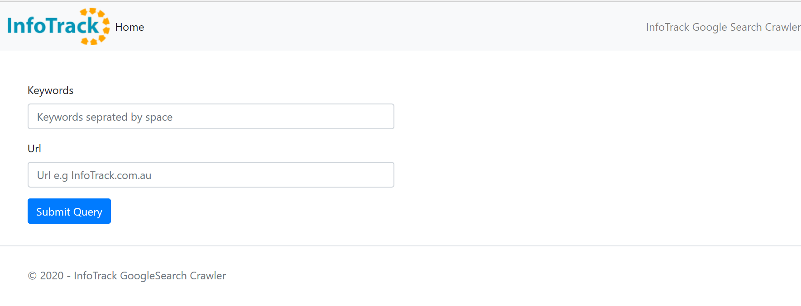
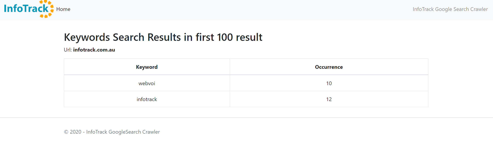
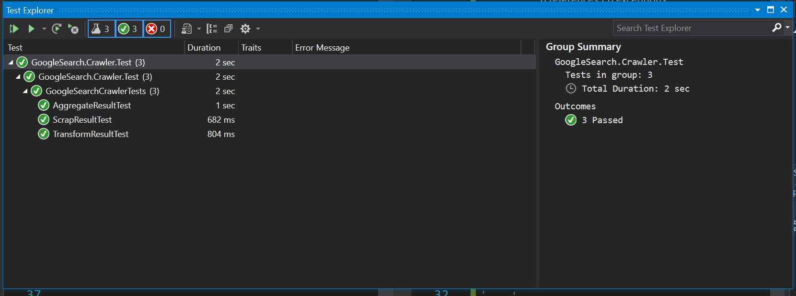

# GoogleSearchCrawler

### Google Search Project Structure 
1. This solution is implemented using .Net Core version 2.1 and runs as a MVC application

2.  The root directory contains README file. solution file and projects folder  

4. In order to be scalable and maintainable, the Search Crawler application divided into the following projects.
--- 
- <b>GoogleSearch.Entities </b>
	- This project provides plain entity classes like `Search Result` etc.
- <b>GoogleSearch.Crawler.Services</b>
  -  This Project provides service interfaces and their implementation. Services such as content scrapper and search parser.
  -  Search service scraps the content from Google using `HtmlAgilityPack` nugget package by making HttpRequest using `HttpClient` object
  -  Content is passed to `Search Parser` service for transformation based on Xpath.
  -  The transformed html node collection is passed to `Search parser's aggregate function` to aggregate and construct the search result object
  -  Another class in this project is `SearchRequestHandler`. Request handler implements the mediator pattern using Mediator nugget package. 
  - Request handler simply accept a custom request object, execute the logic using functionalities provided by `GoogleSearch.Crawler.Services` project and return a response
  - `SearchRequestHandler` makes subsequent GET calls to `SearchService` in order to scrap first 100 search result.
  -  Search request and response DTO objects are in this project. 
  -  It is a standard .net library
- <b> GoogleSearch.Crawler</b>
  - This project is MVC layer of the application. The MVC controller and Views are in this project.
  - The controller accepts the user input, validate it and send it to mediator middleware 
  - Dependencies are resolved in this project using .net core built-in DI container 
  - `GoogleSearch.Crawler.Service`  dependency on `Httpclient` object is resolved in here.
 
- <b>GoogleSearch.Crawler.Test </b>
  - This is test project. Test methods are testing the complete flow of the application from start to end. The flow is like this:
  - Scraping the content from google based on keywords and url 
  - Checking if the extracted content is valid Html document 
  - Parsing the content according to the Xpath of the html node and ensuring result are not empty
  - Testing the aggregate method and making sure that keywords occurrence counted in result 

#### How to run the project 

1. Open the solution in visual studio 2017 or above 
2. Make sure the starting project is set to `GoogleSearch.Crawler`
3. Run it by using IIS Express

<b>Example screen When program loads</b>

<b> Key in few Keywords and url </b>

<b> Search Result </b>

<b> Unit tests result </b>

